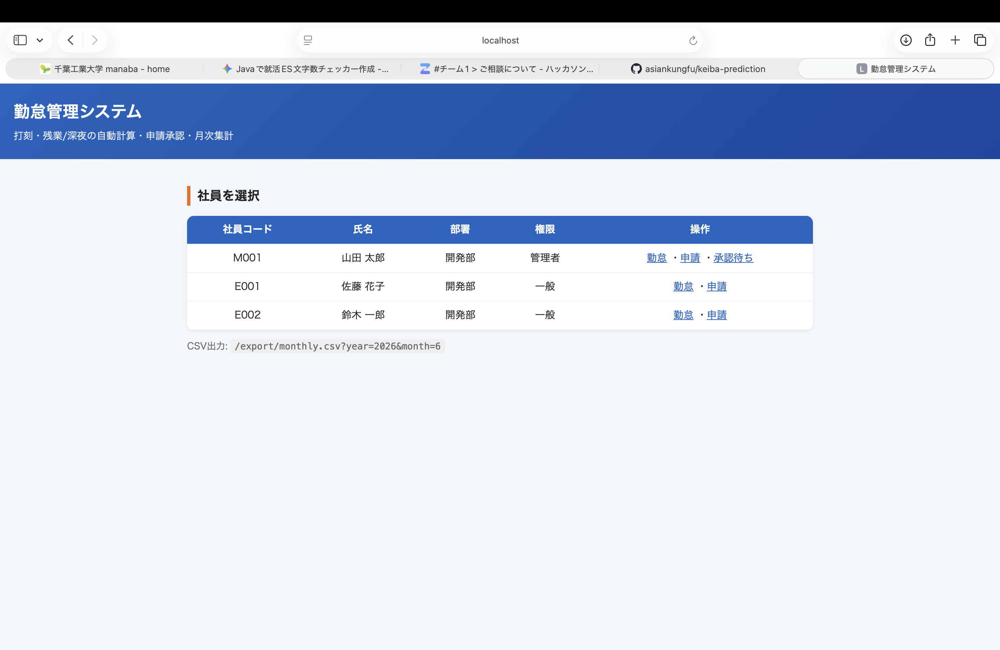
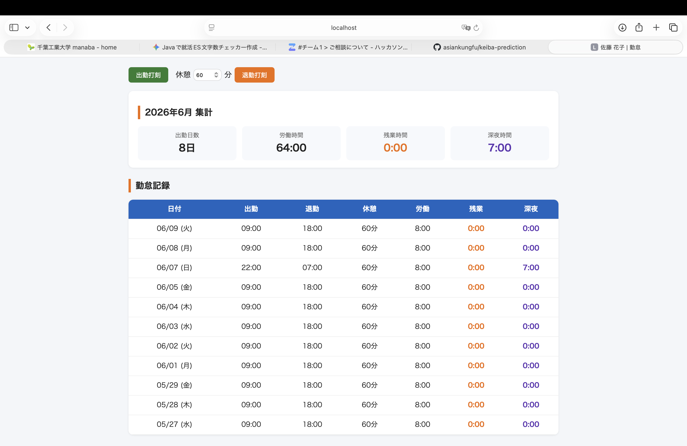
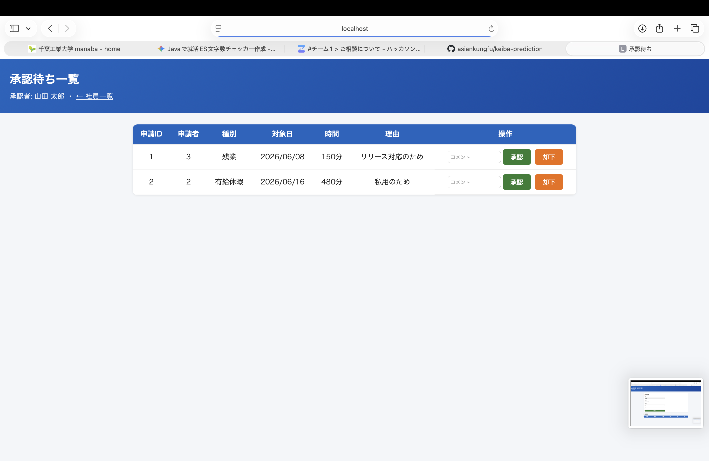

# 勤怠管理システム（kintai-management）

社員の打刻から**労働時間・残業時間・深夜時間を自動計算**し、**申請承認ワークフロー**と
**月次集計（CSV出力）**まで備えた勤怠管理システムです。就職活動のポートフォリオとして、
業務系で重視される **業務ロジック・状態遷移・トランザクション・テスト容易性** を意識して実装しました。

## デモ画面

| 社員一覧 (`/`) | 勤怠・集計 | 承認待ち |
|---|---|---|
|  |  |  |

> スクショは初回起動後に撮影して `docs/images/` に置き換えてください。

## 主な特徴（アピールポイント）

- **労働時間の自動計算ロジック** — 労働・残業・深夜(22:00〜翌5:00)を算出。**日跨ぎの夜勤にも対応**。
  副作用のない純粋クラス `WorkTimeCalculator` に分離し、JUnitで通常/残業/深夜/夜勤/異常系まで単体テスト済み。
- **承認ワークフローの状態遷移を厳格制御** — `PENDING` からのみ承認/却下/取下げ可能。
  **二重承認や他人による取下げを例外で防止**（Mockitoでテスト）。
- **月次集計・CSV出力・REST API** — 集計をJSON取得、全社員分をCSVダウンロード。
- **セットアップ不要で即起動** — H2＋初期データで `mvn spring-boot:run` だけで動作。本番はPostgreSQL。

## 技術スタック

Java 17 / Spring Boot 3.3（Web・Data JPA・Thymeleaf）/ H2・PostgreSQL / Maven / JUnit 5・AssertJ・Mockito

## アーキテクチャ

```
web        … Controller（画面・REST・CSV）
service    … AttendanceService / ApprovalService / MonthlySummaryService
             WorkTimeCalculator（純粋ロジック：労働・残業・深夜）
domain     … Employee / AttendanceRecord / ApprovalRequest
repository … Spring Data JPA
```

詳細は [docs/design.md](docs/design.md)（設計書）を参照。

## 動かし方

前提: JDK 17 以上、Maven 3.9 以上

```bash
mvn spring-boot:run
# http://localhost:8080/                         社員一覧（デモ社員3名が投入済み）
# http://localhost:8080/employees/2/attendance   勤怠・今月集計
# http://localhost:8080/employees/2/requests      申請
# http://localhost:8080/approvals?approverId=1     承認待ち（管理者: 山田）
# http://localhost:8080/api/employees/2/summary?year=2026&month=6   集計API(JSON)
# http://localhost:8080/export/monthly.csv?year=2026&month=6        CSV出力
```

### テスト

```bash
mvn test
```

労働時間計算（`WorkTimeCalculatorTest`）と承認ワークフロー（`ApprovalServiceTest`）を検証します。

### 本番想定（PostgreSQL）

```bash
export DB_URL=jdbc:postgresql://localhost:5432/kintai
export DB_USER=kintai
export DB_PASSWORD=kintai
mvn spring-boot:run -Dspring-boot.run.profiles=prod
```

## ディレクトリ構成

```
kintai-management/
├── pom.xml
├── docs/design.md
└── src/
    ├── main/java/com/example/kintai/
    │   ├── domain/      ← エンティティ・enum
    │   ├── repository/  ← 永続化
    │   ├── service/     ← 業務ロジック・承認フロー・労働時間計算
    │   ├── web/         ← Controller（画面/REST/CSV）
    │   └── config/      ← 設定・初期データ
    ├── main/resources/  ← application.yml / templates / css
    └── test/            ← 単体テスト
```

## 免責

本システムはポートフォリオ用のデモであり、実際の給与計算・労務管理にそのまま用いることは想定していません。
