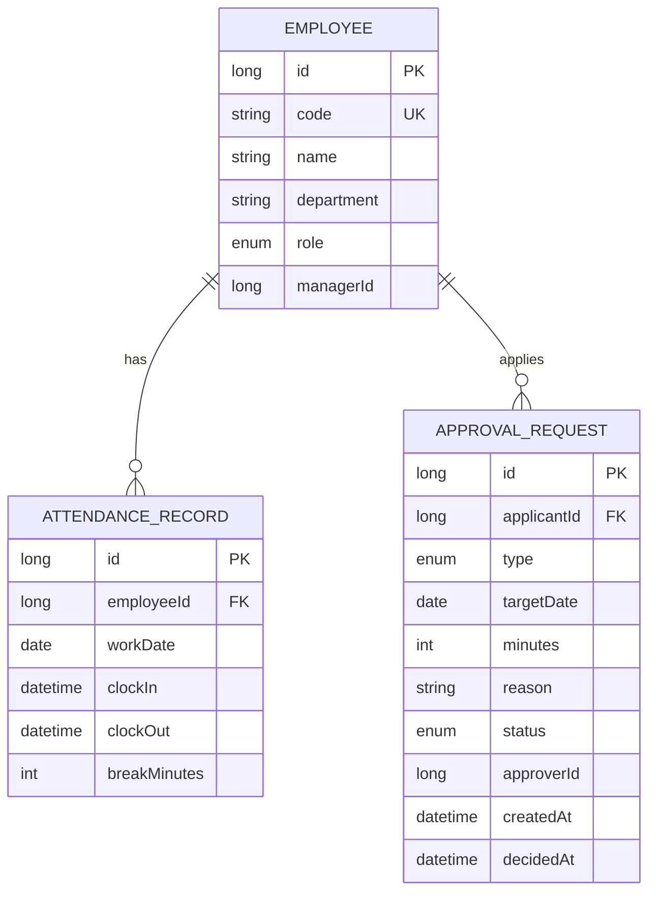

# 設計書 — 勤怠管理システム

## 1. 目的・概要

社員の出退勤を打刻し、**労働時間・残業時間・深夜時間を自動計算**するとともに、
残業・休暇などの**申請承認ワークフロー**と**月次集計（CSV出力）**を提供する勤怠管理システム。

就職活動のポートフォリオとして、業務系（SIer）で重視される
**業務ロジック・状態遷移（承認フロー）・トランザクション・テスト容易性・保守性**を意識して実装した。

## 2. 機能要件

| ID | 機能 | 概要 |
|----|------|------|
| F-01 | 打刻 | 出勤・退勤を打刻し、休憩時間を記録 |
| F-02 | 労働時間自動計算 | 労働・残業・深夜（22:00〜翌5:00）を自動算出。夜勤（日跨ぎ）対応 |
| F-03 | 申請 | 残業・有給・打刻修正を申請（PENDING） |
| F-04 | 承認ワークフロー | 承認者が承認/却下、申請者が取下げ。状態遷移を厳格に制御 |
| F-05 | 月次集計 | 社員ごとに出勤日数・労働・残業・深夜を集計 |
| F-06 | CSV出力 | 全社員の月次集計をCSVでダウンロード |
| F-07 | REST API | 月次集計をJSONで取得 |

## 3. 非機能・設計方針

- **業務ロジックの分離とテスト容易性**: 労働時間計算を副作用のない純粋クラス
  `WorkTimeCalculator` に切り出し、JUnitで網羅的に単体テスト（通常/残業/深夜/夜勤/異常系）。
- **状態遷移の安全性**: 承認は `PENDING` からのみ遷移可能とし、二重承認・不正取下げを
  `IllegalStateException` で防止（`ApprovalService`）。Mockitoでテスト。
- **即起動**: H2＋初期データ（`DataSeeder`）で `mvn spring-boot:run` だけで動作。本番はPostgreSQL。
- **設定の外出し**: 所定労働時間を `application.yml`（`kintai.work-rule.*`）で変更可能。

## 4. 技術スタック

Java 17 / Spring Boot 3.3（Web・Data JPA・Thymeleaf・Validation）/ H2・PostgreSQL / Maven / JUnit 5・AssertJ・Mockito

## 5. アーキテクチャ（レイヤード）

```
web        … Controller（画面・REST・CSV）
service    … AttendanceService / ApprovalService / MonthlySummaryService
             WorkTimeCalculator（純粋ロジック：労働・残業・深夜）
domain     … Employee / AttendanceRecord / ApprovalRequest（＋enum）
repository … Spring Data JPA
config     … WorkRuleProperties / AppConfig / DataSeeder
```

依存方向は上→下の一方向。`WorkTimeCalculator` はフレームワーク非依存にして単体テスト可能。

## 6. データモデル（ER）



`(employeeId, workDate)` に一意制約を張り、1日1レコードを保証する。

## 7. 労働時間計算ロジック

```
実労働時間 = (退勤 − 出勤) − 休憩
残業時間   = max(0, 実労働時間 − 所定労働時間(既定480分))
深夜時間   = 勤務区間 ∩ (22:00〜翌05:00) の分数
```

深夜時間は各日の「早朝帯 00:00–05:00」と「深夜帯 22:00–24:00」に分けて重なりを合計するため、
**日付をまたぐ夜勤**（例: 22:00→翌07:00）も正しく計算できる。

### 計算例（単体テストで検証済み）

| 勤務 | 休憩 | 労働 | 残業 | 深夜 |
|------|----:|----:|----:|----:|
| 9:00–18:00 | 60分 | 8:00 | 0:00 | 0:00 |
| 9:00–21:30 | 60分 | 11:30 | 3:30 | 0:00 |
| 18:00–24:00 | 0分 | 6:00 | 0:00 | 2:00 |
| 22:00–翌07:00（夜勤） | 60分 | 8:00 | 0:00 | 7:00 |

## 8. 承認ワークフロー（状態遷移）

```
            submit              approve
   (新規) ─────────▶ PENDING ───────────▶ APPROVED
                       │  ├── reject ───▶ REJECTED
                       │  └── cancel ───▶ CANCELLED（申請者本人のみ）
```

`PENDING` 以外からの遷移は不可。二重承認や他人による取下げは例外で弾く。

## 9. 画面・API

- `/` … 社員一覧
- `/employees/{id}/attendance` … 打刻・勤怠表・今月集計
- `/employees/{id}/requests` … 自分の申請・新規申請
- `/approvals?approverId=` … 承認待ち一覧（承認/却下）
- `/api/employees/{id}/summary?year=&month=` … 月次集計（JSON）
- `/export/monthly.csv?year=&month=` … 全社員の月次集計（CSV）

## 10. 今後の拡張

- 認証・認可（Spring Security）でロール別アクセス制御。
- 割増賃金の金額計算（深夜25%・残業25%・休日35%）。
- 36協定の上限チェック・アラート。
- 打刻のスマホ対応／打刻打ち忘れ通知のバッチ。
